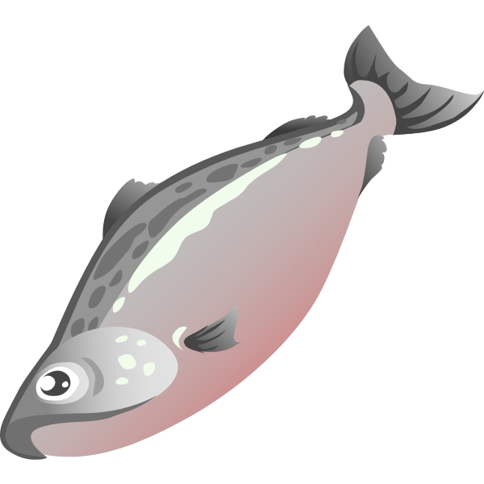

# cookie-stand
201 labs 06-10b

# About Me

In this About Me repository, I'll be working on a project called Cookie Stand/Salmon Cookies.

## Author: Sarah Glass

## Labs 06 - 10b

## Links and Resources:
Problem Domain listed [here](https://codefellows.github.io/code-201-guide/curriculum/class-06/lab/)

## Most Recent Lighthouse accessibility score (insert screenshot)

## Reflections and Comments

This series of labs was a challenge, and I fully acknowledge that my end result looks pretty awful - but at least I have all the required information, my sales table works (knock on wood it stays that way), and I did my best! I have a lot of work to do in getting my CSS more functional and less terrible, overall. 
